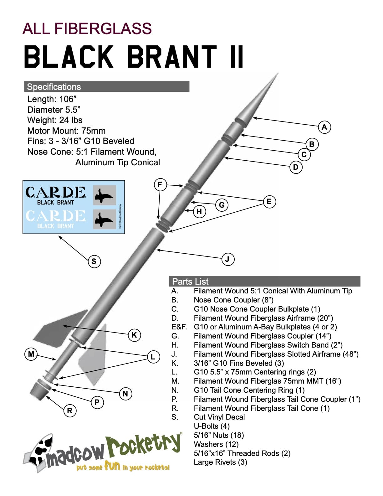

This build is based on the _old_ Rocketry Warehouse (now from [Madcow Rocketry](https://www.madcowrocketry.com/)) 5.5" kit with some modifications. There is a 6" diameter equivalent that [Madcow still sell](https://www.madcowrocketry.com/6-fiberglass-black-brant-ii/). The included instructions are sparse but - to be fair - if you need detailed instructions for a kit of this type then it's probably not the right kit for you.

We'll start from the ends of the build and work our way to the middle ...

## Tailcone

### Materials

|Qty | Item | Source |
|--- |---   |--- |
| 3 | M5 connector nuts | [ToolStation](https://www.toolstation.com/stainless-steel-connector-nut/p28559) |
| 3 | Countersunk Socket Screws M5 X 16  | [ScrewFix](https://www.screwfix.com/p/easyfix-countersunk-head-socket-screws-a2-stainless-steel-m5-x-16mm-50-pack/5982t) |
| 3 | Set Screws M5 X 10MM | [ScrewFix](https://www.screwfix.com/p/easyfix-bzp-steel-set-screws-m5-x-10mm-100-pack/3530h) |

The tailcone section consists of the tailcone itself, a centering ring and a coupler. I also acquired a thrust plate from [SC Precision](https://scpconcepts.com/thrust-plates/), which required removing a small amount of the aft tailcone section to fit a 5" diameter plate.



The thrust plate is a beautifully machined part and allows for the attachment of the [Aeropack 75mm Flanged Motor Retainer](https://aeropack.net/motorretainers.asp)

### Bolt it together

The first step is to shorten the connector nuts to cater for the distance between the centering ring and thrust plate. Then use some M6 bolts through the ring and into the connector nuts. You can see from the images here that this allows for removal of the thrust plate once the ring is bonded to the tailcone.



### Bonding

We can now insert the assembly into the tailcone and bond in place. We need to make sure we get plenty of epoxy on the forward bolts inside since these will not be accessible after assembly and we definitely do not want these to loosen up!

The aft side is also bonded in to the tailcone to provide a nice solid mount for the thrust plate.



## Nosecone

The payload section for this rocket is relatively small considering the weight of the rocket and the parachute size required. I also **hate** to waste all of that empt space in the nose cone so I build a removable base for the nose cone that maximises the payload space and allows for mounting equipment inside the nosecone itself

### Materials

|Qty | Item | Source |
|--- |---   |--- |
| 5 | M6 connector nuts | [ToolStation](https://www.toolstation.com/connector-nut/p29740) |
| 4 | M6 X 50mm Pan Head Machine Screws | [ScrewFix](https://www.screwfix.com/p/easyfix-bright-zinc-plated-pan-head-machine-screws-m6-x-50mm-25-pack/8253j_) |
| 4 | M6 x 25mm Socket Cap Screws | [ToolStation](https://www.toolstation.com/stainless-steel-socket-cap-screw/p36417) |
| 1 | M6 X 11 Eye Bolt | [Amazon](https://smile.amazon.co.uk/gp/product/B01M1IPKPA/) |

### Prepare the base

The base plate is constructed as follows

* Mark the position for the four mounting holes
  * Allow for the flat side of the connector nut to be flush to the side of the disk
* Drill the holes using a 6mm drill bit
* Assemble the Allen bolts into the connector nuts



### Prepare the Mounts

The base is now mounted into the nose cone / payload bay coupler by

* Attach the M6 Pan Head screws into the connector nuts
* Insert the plate into the coupler so it is flat and square
* Prepare the fibreglass
  * horizontal lengths fibreglass
  * vertical length fibreglass
  * Bulldog clips
  * baking parchment
* Apply the fibreglass
  * one vertical piece
  * one horizontal piece
  * cover with baking parchment to allow removal
  * clip in place to ensure the fibreglass wraps around the bolt

The result is difficult to see in the photos, but the bolts and connector nuts are secured to the inside of the coupler



### Finish the Mount

At this point, the eye-bolt is secured to the plate using an M6 Connector nut. This allows for using a threaded rod _inside_ the nosecone to mount equipment (GPS, etc.) and take advantage of all that space!

The base is easily removed and attached using the four socket head screws.

{}
Unless you can drill the mounting holes _exactly_ distanced, which I am not able to do, marking one of the holes on the plate and coupler side will ensure you can get things to align correctly the next time.
{}



## Forward CR

The forward centring ring is modified here to support two mounts and bonded just forward of the fin slots.

### Materials

|Qty | Item | Source |
|--- |---   |--- |
| 2  | M6 X 11 Eye Bolt | [Amazon](https://smile.amazon.co.uk/gp/product/B01M1IPKPA/) |
| 2 | M6 Steel Nut | [ToolStation](https://www.toolstation.com/stainless-steel-nut/p30317) |
| 2 | M6 Washer | |
| 2 | M6 Lock Washer | |

### Prep the CR

The original CR has one hole drilled for a mount point, so we need to drill another 6mm hole directly across from the original.

We then attach two M6 eye bolts using an M6 nut, M6 Washer and an M6 lock washer.

At this point, we can attach the y-harness directly to the eye bolts. See my [Post on Splicing](/post/splicing) on how I do this.



### Bond the CR

We want the CR to be positioned just above the fin slots so we dry fit the CR to make sure we have a good fit and gently sand if required.

Remove the CR and apply epoxy to the airframe where the CR will be bonded and insert into the airframe making sure is nice and square. Make a nice fillet on the FWD side of the CR and allow the epoxy to cure.

Once cured, we can epoxy the AFT side fo the CR, making sure to get the nuts and washers nicely covered so they don't move ... ever.



## Motor Mount

### Aft Assembly

At this point, we prepare the AFT assembly for bonding to the main airframe.

Keeping the thrust plate and motor retainer in place, we insert the motor mount so it will be in the right position after bonding. Get a good fillet of epoxy on the motor mount/AFT centering ring.

Once cured, we apply a good amount of epoxy around the inside edge of the tailcone and insert the coupler. Once inserted, clean up and make a nice fillet on the couple and tailcone.



### Mount Bonding

For the final motor mount steps, the mid CR needs to go onto the motor mount and epoxy applied to the mount where the forward CR will attach. We also apply epoxy to the aft inner airframe for the mid CR as well as the tail cone coupler. I use [rocket poxy](https://www.glenmarc.com/datasheets/EPOXY/RP_G5000_DATASHEET.pdf) so have plenty of time to perform this operation.

The aft assembly is inserted into the airframe and through the fwd cr. The mid CR is inserted just behind the aft of the fin slots and more epoxy is then applied to the motor mount and inside aft airframe.

The entire aft assembly is then completely inserted making sure the mid CR is _still_ aft of the fin slots and the tailcone coupler is completely engaged.

The whole aft airframe can now be place vertically while the epoxy cures.



## Fins

### Mounting



### Fillets



## AV Bay
