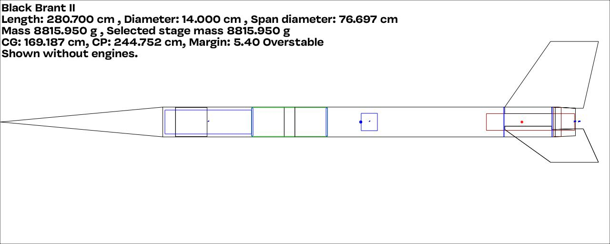

The Black Brant II was a very successful sounding rocket produced by the Canadian Armament Research and Development Establishment (CARDE) beginning 1960. This is my build of a 5.5" diameter model of the three fin version.

The design is shown here and the [Build info](/docs/builds/black-brant-ii/) is provided in the docs section.

I'm tempted to fly this with a _reversed_ parachute configuration where the drogue is located in the forward payload bay and the main in the aft section. Mainly because of the space constraints and squeezing a large main in the fwd payload will be a really tight fit!

## painting notes

I've gone for the standard (all black fins) approach for this one. Following Peter Alway's drawings, I'm going to do:

* Prime with grey primer
* Mask the leading edges of the fins and paint everything white
* Mask the white bits
  * bottom eight bars 5.5cm wide with one equally around a fin (fin 1)
  * top single bar 22cm wide centred on the fin to the left of fin 1 (fin 2)
  * panel lines on the fins with narrow tape
